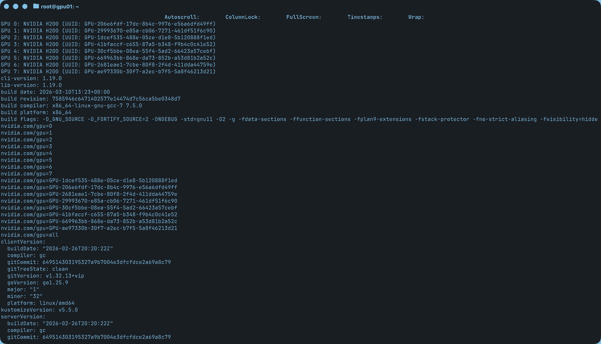
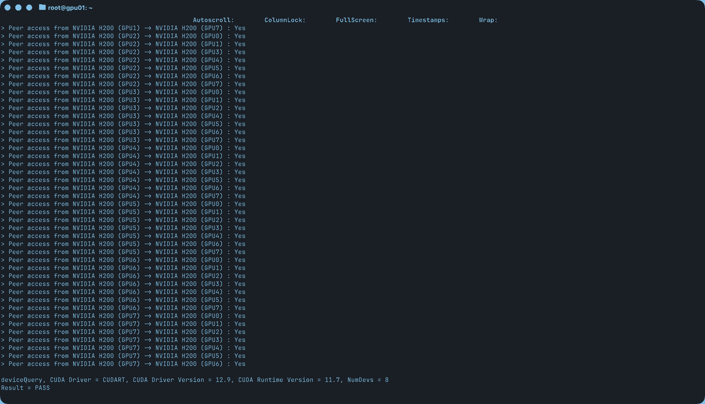
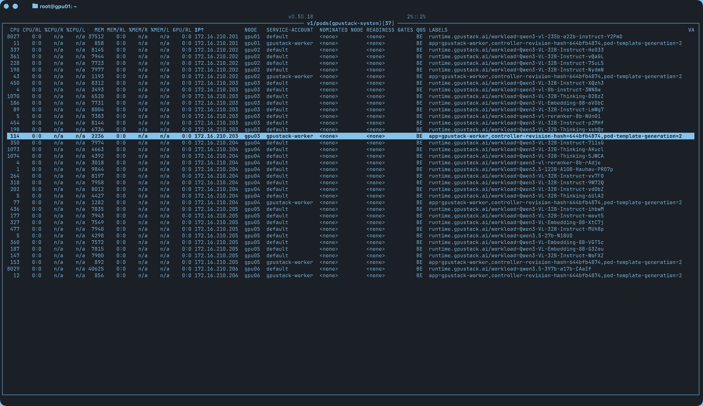

## 概述

GPUStack 是一个开源的 GPU 集群管理器，专为高效的 AI 模型部署而设计。配置和编排推理引擎（vLLM、SGLang、TensorRT-LLM
或自定义的引擎），以优化跨 GPU 集群的性能。其核心功能包括：

- **多集群 GPU 管理。** 跨多个环境管理 GPU 集群。这包括本地服务器、Kubernetes 集群和云提供商。
- **可插拔推理引擎。** 自动配置高性能推理引擎，如 vLLM、SGLang，也可以添加自定义推理引擎。
- **Day 0 模型支持。** GPUStack 的可插拔引擎架构能够在新模型发布当天即可部署。
- **性能优化配置。** 提供预调优模式，用于低延迟或高吞吐量。GPUStack 支持扩展的 KV 缓存系统，如 LMCache 和 HiCache，以减少
  TTFT。还包括对推测性解码方法（如 EAGLE3、MTP 和 N-grams）的内置支持。
- **企业级运维能力。** 支持自动故障恢复、负载均衡、监控、认证和访问控制。

## 架构

GPUStack 使开发团队、IT 组织和服务提供商能够大规模地提供模型即服务。支持用于 LLM、语音、图像和视频模型的行业标准
API。内置用户认证和访问控制、GPU 性能和利用率的实时监控，以及使用量和请求率的计量。

下图是管理跨本地和云环境的多个 GPU 集群。GPUStack 调度器分配 GPU 以最大化资源利用率，并调度推理引擎以实现最佳性能。通过集成的
Grafana 和 Prometheus 仪表板展示系统运行状况和指标。


GPUStack 支持多种 AI 推理加速器：

- **NVIDIA GPU**
- **AMD GPU**
- **Ascend NPU**
- **Hygon DCU**
- **MThreads GPU**
- **Iluvatar GPU**
- **MetaX GPU**
- **Cambricon MLU**
- **T-Head PPU**

有关详细的要求和设置说明，请参阅[安装要求](https://docs.gpustack.ai/latest/installation/requirements/)文档。

## 快速入门

### 前提条件

1. 一个至少配备一块 NVIDIA GPU 的节点。对于其他类型的 GPU，请在 GPUStack UI 中添加 worker
   时查看指南，或参阅[安装文档](https://docs.gpustack.ai/latest/installation/requirements/)获取更多详细信息。
2. 确保 worker 节点上已安装 NVIDIA 驱动程序、[Docker](https://docs.docker.com/engine/install/)
   和 [NVIDIA Container Toolkit](https://docs.nvidia.com/datacenter/cloud-native/container-toolkit/install-guide.html)。
3. 一个用于托管 GPUStack server 的 CPU 节点。GPUStack server 不需要 GPU，可以在仅有 CPU 的机器上运行。
   GPUStack worker 节点仅支持 Linux。

### 安装部署

使用 Docker 安装并启动 GPUStack server：

```bash
docker \
  run -d --name gpustack --restart unless-stopped --network=host \
  -v /var/lib/gpustack:/var/lib/gpustack \
  -v /datapool/models:/var/lib/gpustack/cache \
  swr.cn-south-1.myhuaweicloud.com/gpustack/gpustack:v2.1.2 \
  --system-default-container-registry=swr.cn-south-1.myhuaweicloud.com \
  --bootstrap-password=admin \
  --port=8080 --tls-port=8443 \
  --builtin-grafana-port=3000 \
  --builtin-prometheus-port=9090 \
  --gateway-concurrency=16 \
  --gateway-mode=embedded \
  --disable-openapi-docs \
  --disable-update-check \
  --server-external-url=http://172.16.210.201:8080
```

使用 Docker 安装并启动 GPUStack worker：

```bash
docker \
  run -d --name gpustack-worker --restart unless-stopped --network=host \
  -v /var/lib/gpustack:/var/lib/gpustack \
  -v /datapool/models:/var/lib/gpustack/cache \
  -e GPUSTACK_RUNTIME_DEPLOY_MIRRORED_NAME=gpustack-worker \
  -e GPUSTACK_SERVER_URL=http://172.16.210.201:8080 \
  -e GPUSTACK_TOKEN=gpustack_x16_y32 \
  -v /var/run/docker.sock:/var/run/docker.sock --privileged --runtime=nvidia \
  swr.cn-south-1.myhuaweicloud.com/gpustack/gpustack:v2.1.2 \
  --system-default-container-registry=swr.cn-south-1.myhuaweicloud.com \
  --worker-port=10150 \
  --worker-metrics-port=10151
```

打开浏览器，访问进入 GPUStack UI。使用默认用户名 `admin` 和上面设置的密码
`admin` 登录。

### 测试模型

```bash
curl -u admin:admin http://172.16.210.201:8080/v1/chat/completions \
  -H "Content-Type: application/json" \
  -d '{
  "seed": null,
  "stop": null,
  "temperature": 1,
  "top_p": 1,
  "max_tokens": 32768,
  "frequency_penalty": 0,
  "presence_penalty": 0,
  "model": "GLM-5.1",
  "messages": [
    {
      "role": "user",
      "content": "自我介绍"
    },
    {
      "role": "assistant",
      "content": "提供热情、细腻的回答"
    }
  ]
}'
```

### 部署截图

基于 DaemonSet 自动安装 [NVIDIA Container Toolkit](k3s/nvidia-container-toolkit.yaml)

使用 deviceQuery 校验 GPU 可用性

GPUStack `worker` 部署运行大模型


### [requirements.md#port-requirements](https://github.com/gpustack/gpustack/blob/main/docs/installation/requirements.md#port-requirements)

```shell
:10161 30080 # python[GPUStack-metrics/GPUStack-internalAPI] :10161/metrics
:8080 :8443 :15021 :15090 15000 # envoy[GPUStack-http/GPUStack-https/EnvoyHealth/EnvoyMetrics/EnvoyManagement] :15021/healthz/ready :15090/stats/prometheus 127.0.0.1:15000/config_dump
15010 15012 9876 # pilot-discovery[XDS-HTTP/XDS-gRPC/Introspection]
:15020 # pilot-agent[metrics] :15020/stats/prometheus
8888 15051 # higress[XDS-HTTP/XDS-gRPC]
18443 # apiserver[Higress-API-server] /var/lib/gpustack/higress/kubeconfig
:3000 # grafana
:9090 # prometheus
:5432 # postgres
/usr/bin/postgres -D /var/lib/gpustack/postgresql/data -p 5432 -c config_file=/etc/postgresql/main/postgresql.conf -c hba_file=/etc/postgresql/main/pg_hba.conf
/usr/local/bin/prometheus --config.file=/etc/prometheus/prometheus.yml --storage.tsdb.path=/var/lib/gpustack/prometheus --web.listen-address=0.0.0.0:9090 --web.external-url=/prometheus --web.route-prefix=/prometheus
/usr/local/bin/grafana-server --homepath /opt/grafana --config /etc/grafana/grafana.ini --packaging=gpustack
/usr/local/bin/apiserver --bind-address 127.0.0.1 --secure-port 18443 --storage file --file-root-dir /var/lib/gpustack/higress/apiserver --cert-dir /tmp
/usr/local/bin/higress serve --kubeconfig=/var/lib/gpustack/higress/kubeconfig --gatewaySelectorKey=higress --gatewaySelectorValue=higress-system-higress-gateway --gatewayHttpPort=8080 --gatewayHttpsPort=8443 --ingressClass= --httpAddress=localhost:8888 --grpcAddress=localhost:15051
/usr/local/bin/pilot-discovery discovery --kubeconfig=/var/lib/gpustack/higress/kubeconfig --grpcAddr= --secureGRPCAddr=localhost:15012 --httpAddr=localhost:15010 --httpsAddr= --monitoringAddr= --log_output_level=default:info --domain=cluster.local --keepaliveMaxServerConnectionAge=30m --caCertFile=/etc/certs/ca-cert.pem --meshConfig=/etc/istio/config/mesh --networksConfig=/etc/istio/config/meshNetworks
/usr/local/bin/pilot-agent proxy router --concurrency=16 --domain=higress-system.svc.cluster.local --proxyLogLevel=warning --proxyComponentLogLevel=misc:error --log_output_level=all:info --serviceCluster=higress-gateway
/usr/local/bin/envoy -c etc/istio/proxy/envoy-rev.json --drain-time-s 45 --drain-strategy immediate --local-address-ip-version v4 --file-flush-interval-msec 1000 --disable-hot-restart --allow-unknown-static-fields --log-format %Y-%m-%dT%T.%fZ?%l?envoy %n %g:%#?%v?thread=%t -l warning --component-log-level misc:error --concurrency 16
/usr/bin/python /usr/local/bin/gpustack start --system-default-container-registry=swr.cn-south-1.myhuaweicloud.com --bootstrap-password=admin --builtin-prometheus-port=9090 --builtin-grafana-port=3000 --port=8080 --tls-port=8443 --gateway-concurrency=16 --gateway-mode=embedded
```